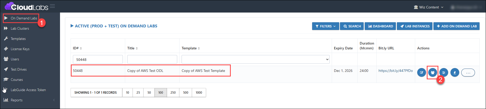
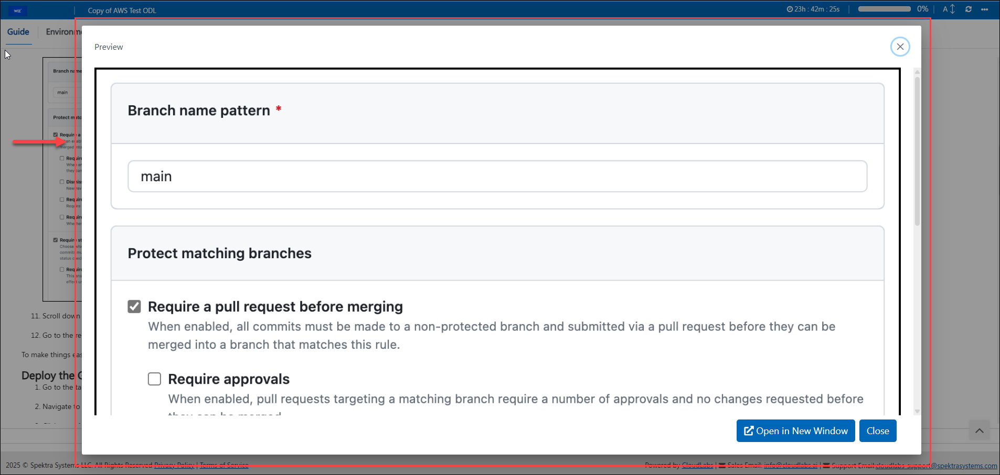
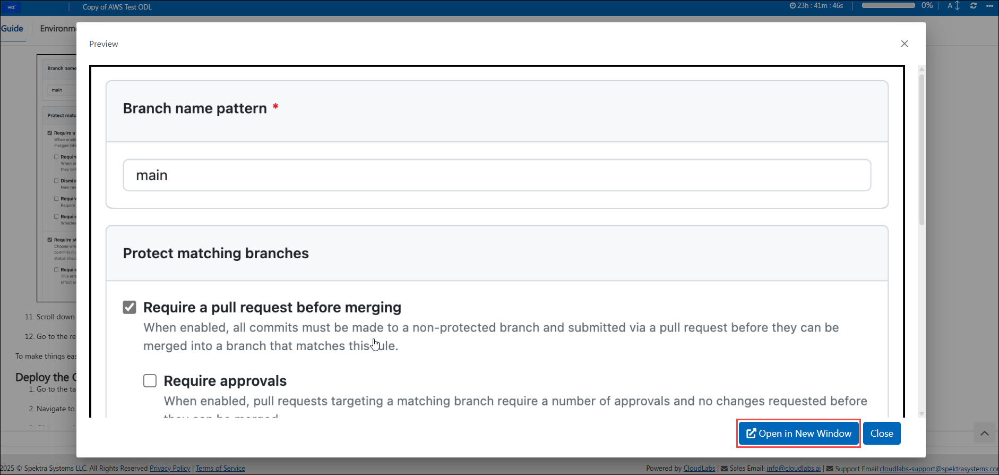

## 49. Revoking the Lab Guide Image Page That Opens in a New Window – Bug Fix

### Feature Requirement

Prevent the Lab Guide image from opening in a new browser window when clicked.

### Implementation

When a user clicks an image in the Lab Guide, the zoomed image should open on the same page, providing an enhanced view without launching a separate window.

### Steps to Test Revoking the Lab Guide Image That Opens in a New Window

1. Log in to the CL portal and navigate to the required tenant (WIZ). On the left-hand side of the page, you will see the ODL section.

2. Navigate to the **ODL (1)** section in the left menu, go to your respective ODL, click the **Users (2)** button, and deploy the user.

   

3. Once the user is deployed, go to any image in the Lab Guide and click on it. The image will be zoomed in within the same window, providing a clearer and larger view.

   

4. At the bottom of the zoomed image, there is an option to open the image in a new window. If needed, the user can click on it to view the image separately.

   

